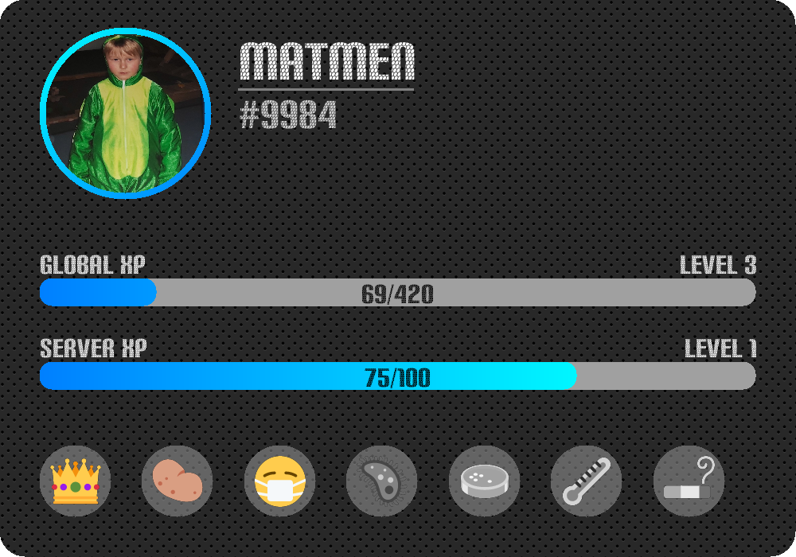

# ImageScript
##### zero-dependency JavaScript image manipulation

  

---

**ImageScript** is a zero-dependency alternative to common JavaScript bitmap image manipulation tools.
It can achieve much more performant results by utilizing lower-level memory access, less memory copying and WebAssembly for compression and encoding.

---

### Features
- [Decoding images](https://oss-is.dreadful.tech/classes/_imagescript_.image.html#decode)
  - PNGs (grayscale, RGB, indexed colors) with and without alpha channels
  - JPEGs (grayscale, RGB, CMYK)
  - TIFFs
- [Rendering SVGs](https://oss-is.dreadful.tech/classes/_imagescript_.image.html#rendersvg)
- [Rendering vector fonts](https://oss-is.dreadful.tech/classes/_imagescript_.image.html#rendertext)
- Image manipulation functions ([crop](https://oss-is.dreadful.tech/classes/_imagescript_.image.html#crop), [rotate](https://oss-is.dreadful.tech/classes/_imagescript_.image.html#rotate), [composite](https://oss-is.dreadful.tech/classes/_imagescript_.image.html#composite), ...)
- Color manipulation functions ([invert](https://oss-is.dreadful.tech/classes/_imagescript_.image.html#invert), [hueShift](https://oss-is.dreadful.tech/classes/_imagescript_.image.html#hueshift), ...)
- Color information functions ([averageColor](https://oss-is.dreadful.tech/classes/_imagescript_.image.html#averagecolor), [dominantColor](https://oss-is.dreadful.tech/classes/_imagescript_.image.html#dominantcolor), ...)
- Encoding images as [PNGs](https://oss-is.dreadful.tech/classes/_imagescript_.image.html#encode), [JPEGs](https://oss-is.dreadful.tech/classes/_imagescript_.image.html#encodeJPEG) and [GIFs](https://oss-is.dreadful.tech/classes/_imagescript_.gif.html#encode)

---

### Example

---

If you have any additional questions, feel free to join the [discord support server](https://discord.gg/8hPrwAH).